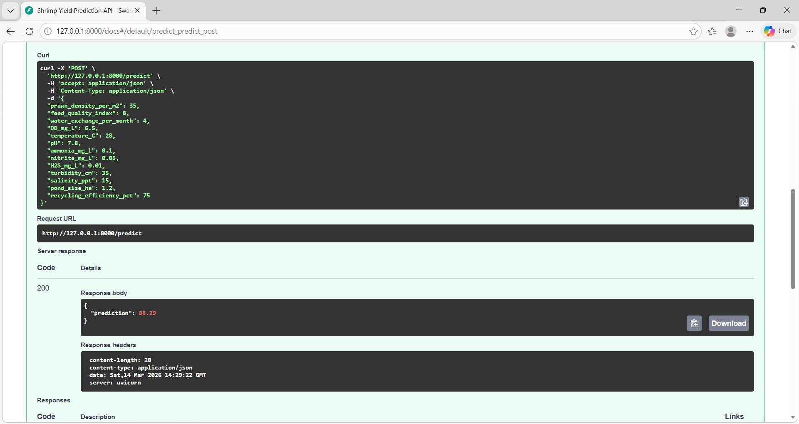

# Shrimp Yield Prediction System

A Machine Learning based web application that predicts shrimp yield using environmental and farming parameters.

## Project Overview

This project helps shrimp farmers estimate expected shrimp yield using machine learning.  
The model analyzes water quality and farming parameters to provide yield predictions.

## Tech Stack

Backend: FastAPI  
Frontend: React  
Machine Learning: Random Forest (scikit-learn)  
Deployment: Vercel  
Tools: Python, Git, GitHub

## Machine Learning Model

Model: Random Forest Regressor  

Performance:
- Train R² ≈ 0.96
- Test R² ≈ 0.84
- MAE ≈ 7.8

## Features

- Predict shrimp yield using ML
- REST API using FastAPI
- Interactive frontend using React
- Real-time prediction results

## API Demo

FastAPI automatically generates interactive API documentation.

## How to Run the Project

1. Clone the repository
